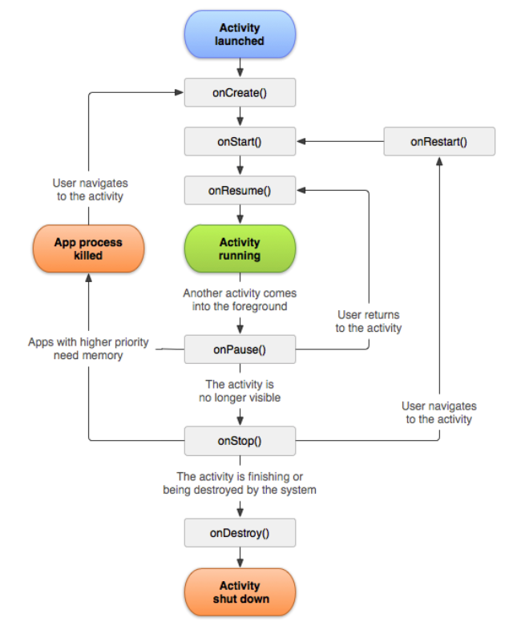
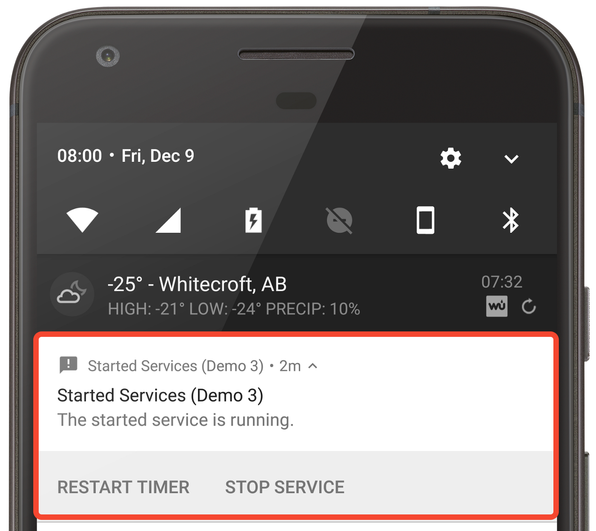
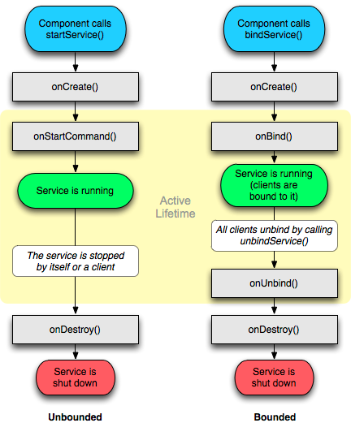
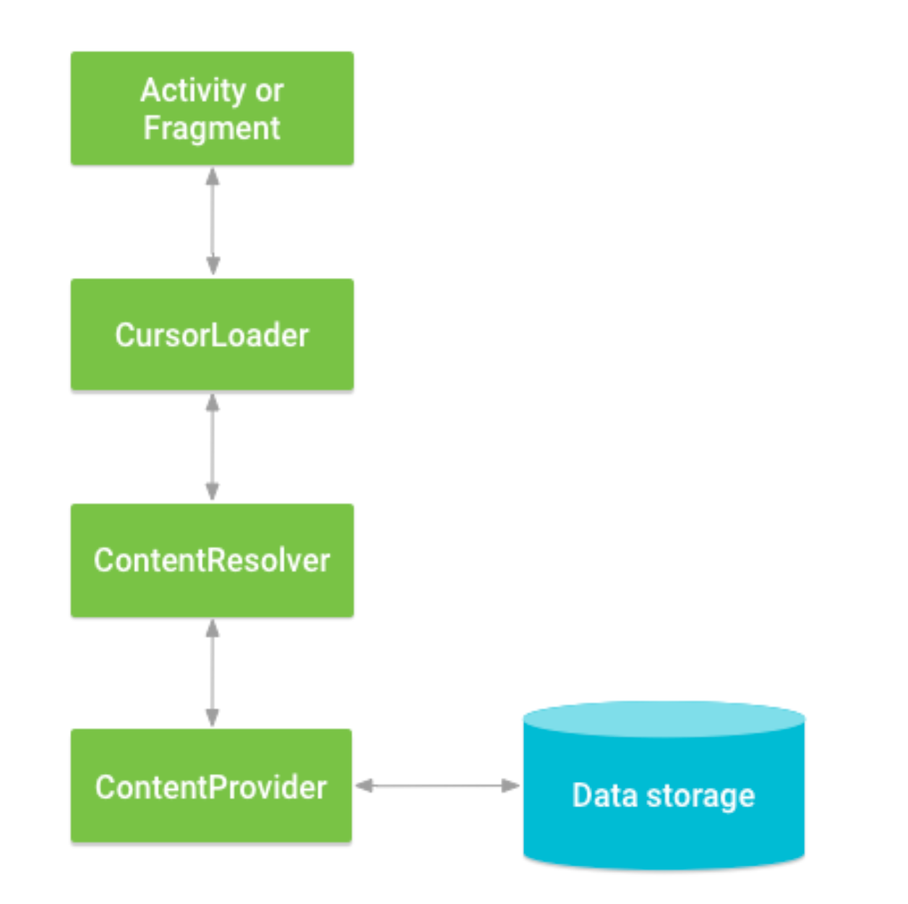

# Android Component

Android 시스템에서 4대 컴포넌트 모두 앱의 Entry Point가 될 수 있음.

# Activity

안드로이드 4대 컴포넌트 중 하나로 사용자와 상호작용을 할 수 있는 UI 를 제공해주는 컴포넌트

## Activity LifeCycle

Activity의 상태에 따라 콜백 호출



### onCreate

- 안드로이드 시스템이 Activity를 생성하면 실행되는 메소드로 `전체 LifeCycle 동안 한 번 호출`
- onCreate 메소드에서 주로 DataBinding, ViewBinding을 통해 UI 구성하는 레이아웃과 연결, View관련 모델들을 보유하고 있는 ViewModel 생성

### onStart

- onCreate 이후 onStart, onResume이 연속적으로 콜백 호출
- onStart가 호출되는 경우는 2가지로 처음 생성 이후와 onRestart 콜백 수신 후 재시작될 때 호출
- onStart에서는 Activity가 포그라운드로 이동할 `준비`

### onResume

- onResume이 호출된 이후부터 Activity가 포그라운드 상태가 되고 `사용자와 상호작용`할 수 있음.
- 전화가 오거나, 홈버튼을 눌러서 Activity가 꺼지는 이벤트가 발생하기 전까지는 onResume 상태에 계속 머무름

### onPause

- Activity가 포그라운드에서 백그라운드로 바뀌는 시점으로 화면의 `일부`가 가려진 상태일 때 onPause 콜백 호출
- Dialog나 투명 Activity가 위에 나타날 경우에도 onPause 상태에 머물게 됨.

### onStop

- 새로운 Activity가 기존의 화면을 전체 가리게 되면 onStop이 호출됨.
- `onPause는 포그라운드에서 백그라운드로 전환되는 시점으로 화면의 일부가 가려진 상태에 호출, onStop은 화면이 완전히 가려질 때 호출`
- 하지만, 이 때도 Activity 객체 자체는 메모리 안에 유지되어 있어 상태나 멤버 정보는 여전히 보유

### onDestroy

- Activity가 완전히 소멸하기 전에 onDestory 콜백 호출
- 공식문서에서 onDestory가 발생하는 경우는 3가지로 규정
    - finish 함수를 통해 명시적으로 종료
    - 기기 회전과 같은 Configuration Change로 인해 일시적 소멸
    - 시스템에 의한 Activity 제거

# BroadcastReceiver

Android 시스템에서 시스템 부팅, USB 연결, 메세지 수신과 같은 다양한 시스템 이벤트 발생할 때 Broadcast를 전송하는데 이를 수신할 수 있도록 하는 컴포넌트

## Broadcast 수신

### manifest에 선언된 수신자

1. Manifest.xml에 <receiver> 요소 지정

    ```xml
    <receiver android:name=".MyBroadcastReceiver"  android:exported="true">
            <intent-filter>
                <action android:name="android.intent.action.BOOT_COMPLETED"/>
                <action android:name="android.intent.action.INPUT_METHOD_CHANGED" />
            </intent-filter>
    </receiver>
    ```


1. BroadcastReceiver 서브클래스 선언 후 onReceive를 구현

    ```kotlin
    private const val TAG = "MyBroadcastReceiver"
    
        class MyBroadcastReceiver : BroadcastReceiver() {
    
            override fun onReceive(context: Context, intent: Intent) {
                StringBuilder().apply {
                    append("Action: ${intent.action}\n")
                    append("URI: ${intent.toUri(Intent.URI_INTENT_SCHEME)}\n")
                    toString().also { log ->
                        Log.d(TAG, log)
                        Toast.makeText(context, log, Toast.LENGTH_LONG).show()
                    }
                }
            }
        }
    ```


1. 앱이 설치될 때 시스템 패키지 관리자가 수신자를 등록, 수신자를 통해 앱으로 통하는 별도의 진입점 역할
    1. 즉, 앱이 아직 실행 중이 아니더라도 시스템에서 앱을 실행

```kotlin
주의사항
Android API 26(O) 부터 manifest를 사용하여 암시적 브로드캐스트 수신을 다수 제한
BOOT_COMPLETED 같은 이벤트와 같이 몇가지 이벤트를 제외하고 명시적으로 타겟 앱 설정
```

### 컨텐스트에 등록된 수신자

1. BroadcastReceiver 인스턴스 생성

    ```kotlin
    val br: BroadcastReceiver = MyBroadcastReceiver()
    ```


1. IntentFilter를 생성하고 registerReceiver를 호출하여 수신자 등록

    ```kotlin
    val filter = IntentFilter(ConnectivityManager.CONNECTIVITY_ACTION).apply {
            addAction(Intent.ACTION_AIRPLANE_MODE_CHANGED)
        }
    registerReceiver(br, filter)
    ```

    - 컨텍스트에 등록된 수신자는 등록 컨텍스트가 유효한 동안만 브로드캐스트 수신
    - Activity에 등록하면 Activity가 종료전까지 수신
    - Application에 등록하면 앱이 실행되는 동안 수신

1. 브로드캐스트 수신 종료
    - unregisterReceiver 메소드 호출

# Service

백그라운드에서 오래 실행되는 작업을 실행할 수 있도록 하는 컴포넌트

## Service 종류

### Foreground Service

사용자에게 보여질 수 있는 작업을 백그라운드에서 수행하는 서비스

ex) 오디오 앱에서 오디오 트랙을 재생할 때 현재 실행중이라는 알림 표시

- 포그라운드 서비스에서는 Notification을 무조건 표시해야함.
- startForeground, stopForeground 메소드를 통해 포그라운드 서비스 시작, 중지



### Background Service

사용자에게 직접 보이지 않는 작업을 수행

- API 26 이전에는 백그라운드 서비스 실행 시 서비스가 종료될 때까지 백그라운드에서 계속 실행
- API 26부터 백그라운드 서비스 실행 제한으로 Foregroune 서비스가 아닌 이상 몇 분 정도의 기간이 지나면 중지

### BindService

애플리케이션 구성요소에 바인딩된 서비스

- 구성요소-서비스가 클라이언트-서버 구조가 되어 요청을 보내고 다른 애플리케이션 구성요소와도 연결이 가능하여 프로세스 간 통신(IPC) 실행 가능
- 바인드 서비스는 구성요소의 라이프사이클까지만 유지되고 백그라운드에서 무한히 실행하지 않음
- ex) 앱, 파일들을 다운로드를 관찰하는 서비스

## Service Lifecycle



서비스 수명 주기는 종류에 따라 2가지로 나뉨

- 백그라운드, 포그라운드 서비스
    - startService, startForegroundService 호출 시에 서비스 생성
    - 서비스가 중지되거나 무기한 실행 시 stopXXService를 명시적으로 호출해야 중단
- 바인딩된 서비스
    - 서비스와 바인딩될 구성요소에서 bindService 호출 시 서비스 생성
    - 서비스 생성 시 IBinder 인터페이스 반환, 해당 인터페이스로 서비스와 통신

# ContentProvider

ContentProvider는 다른 애플리케이션의 데이터에 접근이 필요할 때 사용하게 되는 컴포넌트

- 일반적으로 각 앱은 하나의 프로세스로 프로세스에서 사용하는 데이터는 자신만 접근 가능
- 하지만 사진 앱에 있는 사진을 가져오거나, 연락처에 있는 연락처 정보가 필요한 경우 존재. 이 때 사진 앱에는 ContentProvider가 구현되어 있어 해당 앱의 데이터를 외부에서 사용 가능

## ContentProvider 사용
- 내 애플리케이션에서 다른 애플리케이션의 ContentProvider에 액세스
- 내 애플리케이션에 ContentProvider를 구현하여 다른 애플리케이션에 데이터 공유



- ContentProvider에서 공유가 가능한 데이터는 데이터베이스, 파일 , SharedPreference 하지만 일반적으로 데이터베이스가 주로 사용
- ContentProvider가 생성된 다른 애플리케이션의 데이터를 접근하기 위해서는 ContentResolver 객체 사용, ContentProvider와 서버-클라이언트 구조로 통신
- ContentResolver 객체는 ContentProvider에 데이터 요청
- ContentProvider는 요청된 작업을 실행하고 결과 반환